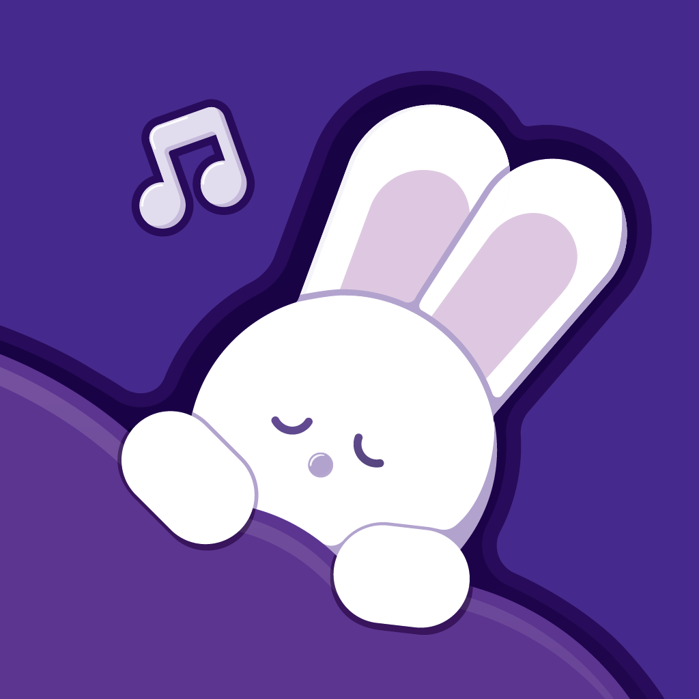

# What is nererun

nererun is a voice application specialized in "sleep training" for children.

The audio stories are produced based on scientific evidence and can lull even children who have difficulty falling asleep to sleep.

# Links

- [homepage](https://nererunkids.studio.site/)

- [AppStore](https://apps.apple.com/us/app/id1591420871)

- [Google Play](https://play.google.com/store/apps/details?id=tokyo.gajo.app.android.nererun)

- [Twitter](https://twitter.com/nererun_jp)

- [Instagram](https://www.instagram.com/nererun_jp/)

